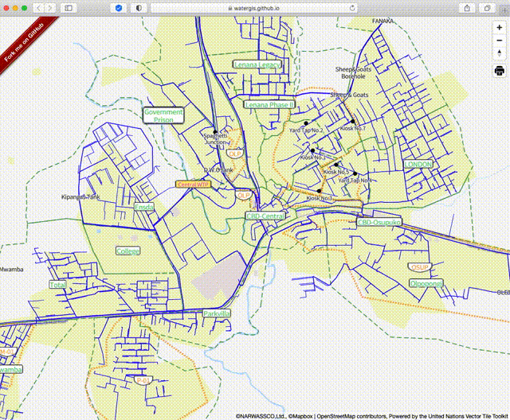

# mapbox-gl-export


This module adds control which can export PDF and images.

This module is using source code of [mpetroff/print-maps](https://github.com/mpetroff/print-maps). I just adopted this library to normal Mapbox GL Plugin. Thanks so much to develop this library!

## for Maplibre GL users

Please consider to use [maplibre-gl-export](https://github.com/watergis/maplibre-gl-export) plugin for Maplibre GL.

## Installation

```bash
npm i @watergis/mapbox-gl-export --save
```

## Use CDN

```html
<link href='https://watergis.github.io/mapbox-gl-export/mapbox-gl-export.css' rel='stylesheet' />
<script src='https://api.mapbox.com/mapbox-gl-js/v1.13.1/mapbox-gl.js'></script>
<script src="https://watergis.github.io/mapbox-gl-export/mapbox-gl-export.js"></script>
<script>
  map.addControl(new MapboxExportControl({
      PageSize: Size.A3,
      PageOrientation: PageOrientation.Portrait,
      Format: Format.PNG,
      DPI: DPI[96],
      Crosshair: true,
      PrintableArea: true,
  }), 'top-right');
</script>
```

Furthermore, you may download specific version's scripts and css locally from [release](https://github.com/watergis/mapbox-gl-export/releases) page.

## Demo

Try [codesandbox](https://codesandbox.io/s/mapbox-gl-export-8x4lw?file=/src/index.ts).

See [demo](https://watergis.github.io/mapbox-gl-export/#12/-1.08551/35.87063).



## Usage

```ts
import { MapboxExportControl, Size, PageOrientation, Format, DPI} from "@watergis/mapbox-gl-export";
import '@watergis/mapbox-gl-export/css/styles.css';
import mapboxgl from 'mapbox-gl';

const map = new mapboxgl.Map();
// create control with default options
map.addControl(new MapboxExportControl(), 'top-right');
// create control with specified options
map.addControl(new MapboxExportControl({
    PageSize: Size.A3,
    PageOrientation: PageOrientation.Portrait,
    Format: Format.PNG,
    DPI: DPI[96],
    Crosshair: true,
    PrintableArea: true
}), 'top-right');
```

### if you want to use a basemap from Mapbox

- for mapbox v1 user

```ts
mapboxgl.accessToken='your mapbox access token'
```

- for mapbox v2 user
There is an option of `accessToken` in `MapboxExportControl`. Please put your accessToken when you create a instance of plugin.

```ts
mapboxgl.accessToken='your mapbox access token'
const map = new mapboxgl.Map({
    container: 'map',
    style: 'mapbox://styles/mapbox/streets-v11',
});
map.addControl(new MapboxExportControl({
    accessToken: 'your mapbox access token'
}), 'top-right');
```

### Options

You can specify default option as follows.

- PageSize
  - You can select from `A2` to `A6` or `B2` to `B6`
  - default page size is `A4`
- PageOrientation
  - You can select `landscape` or `portrait`
  - default is `landscape`
- Format
  - You can select it from `jpg`, `png`, `svg` and `pdf`
  - default is `PDF`
- DPI
  - You can select it from `72`, `96`, `200`, `300` and `400`.
  - default is `300`
- Crosshair
  - Display crosshair on the map. it helps to adjust the map center before printing.
  - accepts `true` and `false` value
  - default is `false`
- PritableArea
  - Display printable area on the map it helps to adjust pritable area before printing.
  - accepts `true` and `false` value
  - default is `false`
- Local
  - default `en` for english
  - `de` german
  - `fr` french
  - `fi` finnish
  - `sv` swedish
## Attribution

When you use exported map, please includes attribution as follows.

If you can include HTML, use this code snippet that includes links to Mapbox & OpenStreetMap:

```html
© NARWASSCO, Ltd. © <a href='https://www.mapbox.com/about/maps/'>Mapbox</a> © <a href='https://www.openstreetmap.org/copyright'>OpenStreetMap</a> <strong><a href='https://www.mapbox.com/map-feedback/' target='_blank'>Improve this map</a></strong>Powered by the United Nations Vector Tile Toolkit
```

For print output or if you can’t include links, use this text-only attribution:

```
© NARWASSCO, Ltd. ©Mapbox ©OpenStreetMap contributors, Powered by the United Nations Vector Tile Toolkit
```

`© NARWASSCO, Ltd.` is default example of map data by `Narok Water and Sewerage Services Co., Ltd.`, Kenya. If you don't use current map, you don't need to use this attribution.

Also, default example is using base map by United Nation Vector Tile Toolkit. That is why `Powered by the United Nations Vector Tile Toolkit` is included in above.

## Development

```bash
npm run lint # check styling of source code
npm run lint:fix # fix styling by eslint
npm run dev
```

open [http://localhost:8080](http://localhost:8080).

If there are any changes on source code, it will be reflected automatically.

## Build package

```bash
npm run build
```

The modules will be generated under `dist` folder.

## Deploy to Github pages

```bash
npm run deploy
```

It will deploy files under `example` folder to gh-pages.

## How to release

```zsh
npm version patch # it increase patch version 0.0.X
npm version minor # it increase minor version 0.x.0
npm version major # it increase major version x.0.0
git push origin master --tag
# release CI will create draft release in Github pages, then publish it if it is ready.
# publish CI will deploy npmjs and Github Packages.
```

## Contribution

This Mapbox GL Export Control is still under development. so most welcome any feedbacks and pull request to this repository.
